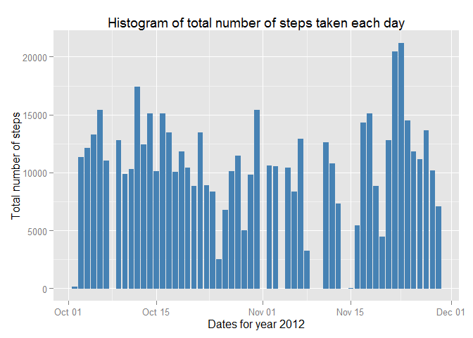

# Reproducible Research: Peer Assessment 1


## Loading and preprocessing the data


```r
data <- read.csv('activity.csv', sep = ",", header = TRUE, 
                 colClasses = c("integer", "Date", "integer"))
```

## What is mean total number of steps taken per day?

Ignoring the missing values in the database for this part.

- Making a Histogra of the total number of steps taken each day.


```r
library(ggplot2)
ggplot(data, aes(date, steps)) + 
  geom_bar(stat = "identity", colour = "steelblue", fill = "steelblue", width = 3/4) + 
  labs(title = "Histogram of total number of steps taken each day", 
       x = "Dates for year 2012", y = "Total number of steps")
```

```
## Warning: Removed 2304 rows containing missing values (position_stack).
```

 

- Calculating the **mean** and **median** of total number of steps taken per day


```r
total_steps <- tapply(data$steps, data$date, FUN = sum, na.rm = FALSE)
mean(total_steps, na.rm = TRUE)
```

```
## [1] 10766
```

```r
median(total_steps, na.rm = TRUE)
```

```
## [1] 10765
```

The **mean** for the dataset is **10766** and

The **median** for the dataset is **10765**

## What is the average daily activity pattern?

Ignoring the missing values in the database for this part.

- Making a time series plot of the 5-minute interval and the average number of steps taken, averaged across all days.


```r
library(ggplot2)
average <- aggregate(x = list(steps = data$steps), by = list(interval = data$interval),
                      FUN = mean, na.rm = TRUE)
ggplot(data = average, aes(x = interval, y = steps)) +
  geom_line(color = "steelblue") +
  labs(title = "Time series plot of the 5-minute interval", 
       x = "5-minute intervals", 
       y = "Average number of steps taken")
```

 

- Calculating which 5-minute interval, on average across all the days contains the maximum number of steps.


```r
average[which.max(average$steps),]
```

```
##     interval steps
## 104      835 206.2
```

**On average interval number 835 contains the maximum number of steps 206 steps**

## Imputing missing values

- Calculating the total number of missing values in the dataset


```r
sum(is.na(data$steps))
```

```
## [1] 2304
```

**Total number of missing values are 2304**

- To fill in the missing values(i.e., NA's), each missing value is being replaced by the mean value of its 5-minute interval.

The code for performing this strategy is following:


```r
fill_value <- function(steps, interval) {
  value <- NA
  if (!is.na(steps))
    value <- c(steps)
  else
    value <- (average[average$interval == interval, "steps"])
  return(value)
}
```

- Creating a new dataset named **new_data** that is same as the original dataset **but with the missing data filled in**.


```r
new_data <- data
new_data$steps <- mapply(fill_value, new_data$steps, new_data$interval)
```

This **new_data** is the new dataset containg missing values **replaced** by the mean values of the corresponding 5-minute interval.

- Making a Histogram of the total number of steps taken each day with the new dataset containing no missing values.


```r
library(ggplot2)
ggplot(new_data, aes(date, steps)) + 
  geom_bar(stat = "identity", colour = "steelblue", fill = "steelblue", width = 3/4) + 
  labs(title = "Histogram of total number of steps for each day (without missing values)", 
       x = "Dates for year 2012", y = "Total number of steps")
```

 

- Calculating the **mean** and **median** of total number of steps taken per day.


```r
new_total_steps <- tapply(new_data$steps, new_data$date, FUN = sum)
mean(new_total_steps)
```

```
## [1] 10766
```

```r
median(new_total_steps)
```

```
## [1] 10766
```

The **mean** for the new dataset is **10766** and

The **median** for the new dataset is **10766**

The mean for the new dataset is the same as the one for the original dataset which included NA's.

The median for the new dataset is higher than the original dataset but not by a significant number to make a difference.

Therefore inputing missing data in the estimates of the total daily number of steps has no significant impact on the mean or the median of the two datasets.
 but helps in understanding the trend in the plots better.

## Are there differences in activity patterns between weekdays and weekends?

Continuing using the new dataset without missing values i.e., **new_data**

- Creating a new factor variable in the dataset named **day** with levels **weekday** and **weekend** indicating whether a given date is a weekday or a weekend day.


```r
determine_day_type <- function(date) {
  day_type <- weekdays(date)
  if (day_type %in% c("Monday", "Tuesday", "Wednesday", "Thursday", "Friday"))
    return("weekday")
  else if (day_type %in% c("Saturday", "Sunday"))
    return("weekend")
}
new_data$day <- sapply(new_data$date, FUN = determine_day_type)
```

- Making a time series plot comparing the trend for weekday vs weekend for the 5-minute intervals.


```r
averages <- aggregate(steps ~ interval + day, data=new_data, mean)
ggplot(averages, aes(interval, steps)) + geom_line(color = "steelblue") +
  facet_grid(day ~ .) +
  labs(title = "Time series plot of the 5-minute interval for weekday VS weekend", 
       x = "5-minute intervals", 
       y = "Average number of steps taken")
```

 

